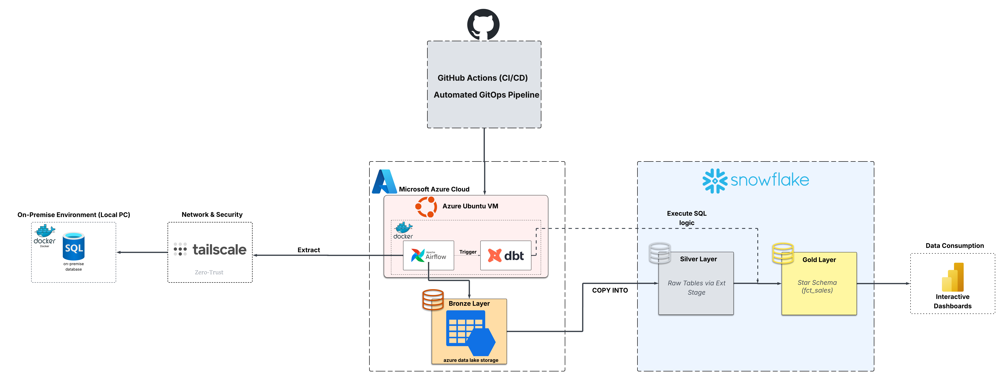

# 🚀 Enterprise Hybrid Cloud ELT Platform


## 📌 Project Overview & Architecture

This project is a fully automated, **Hybrid Cloud ELT (Extract, Load, Transform) Pipeline** designed with industry best practices in mind, emphasizing **Zero-Trust Security, FinOps cost-optimization, and DataOps (CI/CD)**.

The pipeline orchestrates data movement from an on-premise relational database (Microsoft SQL Server - AdventureWorks) to an **Azure Data Lake**, followed by staging and transformation in **Snowflake** to produce a star schema ready for **Power BI** consumption.



## 🧰 Tech Stack & Paradigms

| Category                    | Technology                | Concepts & Paradigms                                                      |
| --------------------------- | ------------------------- | ------------------------------------------------------------------------- |
| **Network & Security**      | **Tailscale Mesh VPN**    | Zero-Trust security, P2P networking, No Port Forwarding.                  |
| **Infrastructure (FinOps)** | **Azure Ubuntu VM**       | Spot Instances, Auto-shutdown (Cost Optimization), Dockerized containers. |
| **Orchestrator (DataOps)**  | **Apache Airflow**        | DAGs, Task dependencies, Azure `WasbHook`.                                |
| **CI/CD**                   | **GitHub Actions**        | Automated GitOps pipeline (SSH, pull, build containers).                  |
| **Data Lake (Bronze)**      | **Azure Blob Storage**    | Raw data storage (CSV/Parquet).                                           |
| **Data Warehouse (Silver)** | **Snowflake**             | External Stages, `COPY INTO`, RBAC access.                                |
| **Transformation (Gold)**   | **dbt (data build tool)** | Dimensional Modeling, Star Schema (`fct_sales`, `dim_customer`).          |
| **BI / Analytics**          | **Power BI**              | Interactive Dashboards natively connected to the Gold layer.              |

---

## ⚙️ Step-by-Step Data Flow

### 1. Secure Data Extraction (Zero-Trust)

Traditional VPNs or open ports expose on-premise environments to attacks. To circumvent this, the orchestrated Airflow environment (running in Azure) connects to the local SQL Server database via a **Tailscale P2P VPN node**. This creates a **Zero-Trust** tunnel, completely bypassing the need for port forwarding or public static IPs.

### 2. Bronze Layer Ingestion (Data Lake)

Using Python and Airflow's `MsSqlHook`, the data from the AdventureWorks DB is queried iteratively. Once extracted, the `WasbHook` buffers and streams the raw tables directly into **Azure Blob Storage (Bronze Layer)** to act as our immutable data lake.

### 3. Silver Layer (Cloud Data Warehouse)

Instead of processing raw files locally, **Snowflake** takes over the compute. Airflow triggers Snowflake tasks that leverage the highly efficient `COPY INTO` command to ingest data from Azure External Stages into raw staging tables. Access between Snowflake and Azure is tightly controlled via Azure Active Directory and **Role-Based Access Control (RBAC)**.

### 4. Gold Layer Transformation (dbt)

The Silver layer is still in 3NF (3rd Normal Form), so we trigger **dbt Core** within Airflow via the `BashOperator`. dbt cleans, tests, and transforms the raw data into a consumption-ready **Star Schema** (featuring objects like `dim_customer` and `fct_sales`).

### 5. Consumption (Power BI)

**Power BI** is configured to query the Snowflake Gold layer directly, seamlessly propagating metrics for business interactive dashboards.

### 6. FinOps & DataOps Strategy

- **FinOps:** The Azure Ubuntu VM hosting the Airflow Master runs on a **Spot Instance**, drastically cutting costs. It features configured auto-shutdown scripts ensuring compute only ticks when the batch orchestrations are actively needed.
- **DataOps:** A complete CI/CD workflow is implemented using **GitHub Actions**. Pushing code to `main` triggers a serverless runner that connects via SSH to the Azure VM, pulls the latest transformations and DAG updates, and dynamically rebuilds the Airflow containers using Docker-compose.

---

## 🚀 How to Run & Deploy

1. **Environment Setup**
   - Pre-requisites: Docker, Docker-compose, Tailscale node authenticated on both your Local PC and the target Cloud VM.
   - Ensure Local SQL Server is running and IP bound to the Tailscale subnet `100.x.x.x`.

2. **Clone and Build**

   ```bash
   git clone https://github.com/YourUsername/azure_ETL.git
   cd azure_ETL/orchestration
   docker-compose up -d --build
   ```

3. **Airflow Configuration**
   - Navigate to `localhost:8080`.
   - Add connections directly in the Airflow UI:
     - `mssql_on_prem`: Target the Tailscale IP of your SQL Server.
     - `azure_data_lake`: Your Azure Storage Account string.
     - `snowflake_default`: Your Snowflake Account credentials and compute warehouse details.

4. **Run Pipelines**
   - Unpause the target DAG: `elt_full_pipeline_azure_snowflake_dbt`.
   - Monitor task execution, specifically observing the dbt run mapping final nodes inside Snowflake.

---
